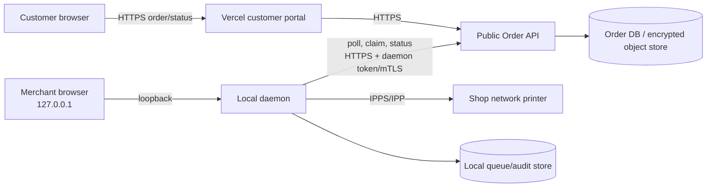
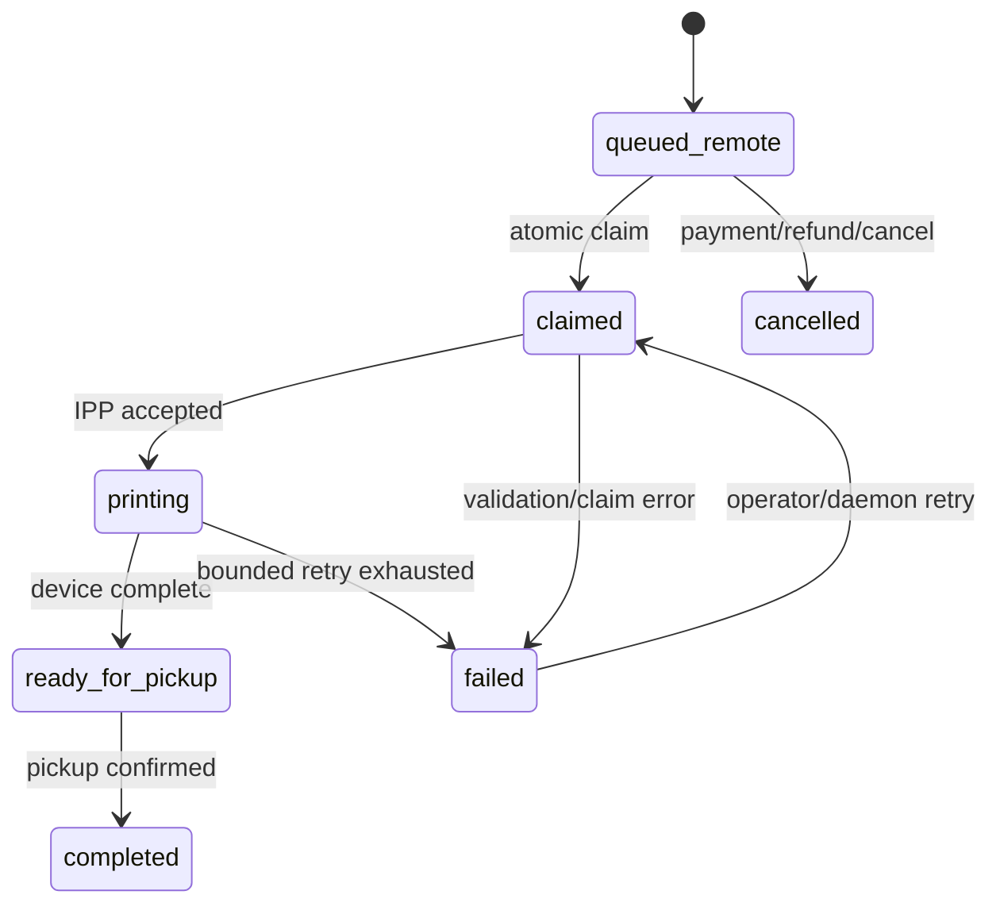

# System Design Document

> **Document ID:** PSD-03 · **Version:** 1.0.0 · **Status:** Approved baseline · **Last updated:** 2026-08-25 · **Owner:** Architecture · **Related documents:** PSD-02, PSD-06.

## 1. Architectural decisions

| Decision | Rationale |
| --- | --- |
| Customer portal is a static Vite/React build on Vercel. | Fast global delivery, small public attack surface, serverless-compatible deployment. |
| Merchant UI is deployed separately in merchant mode and loopback-bound. | Printer control remains on shop-owned equipment and is not publicly hosted. |
| Daemon polls the cloud API; cloud does not call local endpoints. | Works through NAT/firewalls and avoids exposing local ports. |
| Use IPP/IPPS for network printing. | Supports job submission, printer job identifiers, status queries, and TLS-capable IPPS. |
| Shop ID plus daemon credential scopes orders. | Routing is explicit; a non-secret identifier is separated from actual authorization. |
| Idempotency keys and expiring claim leases protect queue state. | Prevents duplicates and permits recovery after daemon/process failure. |

## 2. Component diagram



The UI in this repository currently uses a local React context/demo data for queue interaction. The API, daemon, database, and IPP adapter are production components to implement before live operation.

## 3. Deployment boundaries and data flow

1. Customer portal resolves the shop from QR URL/path and sends `shopId` with the order envelope.
2. Public API validates payment state, schema, idempotency key, and shop authorization; it stores metadata and a protected document reference.
3. Daemon authenticates with a per-shop credential, polls only eligible jobs, and claims each job atomically with a lease.
4. Daemon downloads, malware-scans/validates hash, renders if needed, submits to configured IPPS/IPP target, and writes status/audit events.
5. Customer tracking reads redacted status; merchant console reads local queue/daemon state through loopback.

## 4. Data design

### Public order database (logical schema)

| Entity | Key fields | Notes |
| --- | --- | --- |
| `shops` | `id`, `status`, `routing_key`, `created_at` | `routing_key` maps the public URL to canonical shop ID. |
| `orders` | `id`, `shop_id`, `status`, `idempotency_key`, `payment_state`, `claim_lease_until`, `version` | Unique `(shop_id, idempotency_key)`; optimistic version protects transitions. |
| `order_files` | `id`, `order_id`, `object_key`, `sha256`, `mime_type`, `page_count` | Object key is private; use short-lived signed download URL. |
| `order_events` | `id`, `order_id`, `actor_type`, `event_type`, `payload_redacted`, `created_at` | Immutable audit history; no file body or secrets. |
| `daemon_credentials` | `id`, `shop_id`, `credential_hash`, `expires_at`, `revoked_at` | Prefer mTLS/secret manager; store verifier, not plaintext token. |

### Local daemon store (logical schema)

| Entity | Key fields | Notes |
| --- | --- | --- |
| `local_jobs` | `order_id`, `state`, `printer_id`, `retry_count`, `last_error` | Cache only minimal data needed for recovery. |
| `printers` | `id`, `ipp_uri`, `capabilities`, `status`, `last_seen_at` | Encrypt sensitive configuration at rest where supported. |
| `print_attempts` | `id`, `order_id`, `ipp_job_id`, `outcome`, `started_at` | Enables reconciliation and duplicate prevention. |
| `local_audit` | `id`, `actor`, `action`, `details_redacted`, `created_at` | Append-only operational history. |

## 5. Interface specification

### Public order API

| Endpoint | Auth | Request | Response / key rules |
| --- | --- | --- | --- |
| `POST /v1/orders` | customer/payment session | `shopId`, `idempotencyKey`, customer, files, preferences | `202` + `orderId`, `queued_remote`; validates input and payment authorization. |
| `GET /v1/orders/{id}` | customer tracking token | none | Redacted order status only; enforce order ownership. |
| `GET /v1/merchant/orders` | daemon token/mTLS | `shopId`, cursor | Only authenticated daemon's shop; returns claimable jobs. |
| `POST /v1/merchant/orders/{id}/claim` | daemon token/mTLS | idempotency key, lease duration | Atomic claim; `409` if claimed/terminal. |
| `POST /v1/merchant/orders/{id}/status` | daemon token/mTLS | state, event ID, printer job ID, error category | Enforces valid transition/version and appends audit event. |

Example create payload:

```json
{
  "shopId": "metroprint-downtown",
  "idempotencyKey": "550e8400-e29b-41d4-a716-446655440000",
  "customer": { "name": "Ari", "phone": "+15551234567", "notifyVia": "sms" },
  "files": [{ "uploadUrl": "https://upload.example/...", "sha256": "hex", "pages": 4 }],
  "preferences": { "colorMode": "bw", "paperSize": "A4", "copies": 1 }
}
```

### State machine



## 6. Security and error handling

- API uses TLS 1.2+ (prefer 1.3), strict CORS allowlist, rate limits, schema validation, malware scanning, encrypted storage, short-lived URLs, and redacted logs.
- Merchant UI/daemon bind to `127.0.0.1`; firewall denies inbound non-loopback traffic. Remote support requires authenticated TLS tunnel, device identity, IP allowlisting, short expiry, and audit logs.
- Daemon classifies errors: retryable (`printer_offline`, `network_timeout`) with exponential backoff; permanent (`hash_mismatch`, `unsupported_format`) requires operator resolution. Claim leases expire after daemon interruption.
- Printer URI is allowlisted/configured locally; never accept a printer URI supplied by a customer request.
